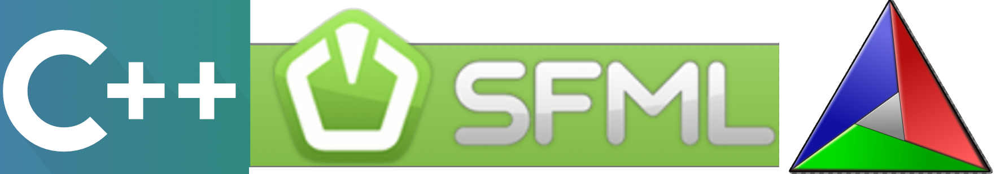

# Update:
This project was created on github.ccs.neu.edu with a team. The account is no longer accessible due to:
```
This is an automated process triggered by the NUID you provided falling out of our registrar data feed. The most likely causes of this are that you have graduated or are no longer taking a class at Khoury. Per university and college policy, services must end within 30 days of such an affiliation change.
```

However I was able to download this previous project before losing access.

# Final Project!

**See Final Project Specifications Below**

## Where to do development?

**Note** You should work on your final project in the A4 repository. Any files otherwise(e.g. build.md or feature1usecase.md) should be modified in this folder and stay in this directory.

## Team

Team Name: *finalproject-team-team*

1. Ryan Newell
2. Andres Schuchert
3. Nikhil Agrawal

## Logistics

- Work with your team to ensure everyone has a way to work on this codebase with a common set of tools.
- Everyone should make code contributions to the repository (i.e. everyone should have some commits in the project log)
- See the project timeline

## Timeline

Click each link to see what you need to do each step along the way.

- [x] [Milestone Check-in 1](milestone1.md) (Week of April 4 - April 9 or before)
  - This is completed with your specific project manager.
- [x] [Extra Feature](extrafeature.md) - (April 10 - 14)
- [x] [Final Deliverable](FinalDeliverable.md) - (April 18)


## Notes on working in teams

* [Four Ways to Lead Your Software Team to Success](https://hackernoon.com/four-ways-to-lead-software-team-to-success-43fa156719b4)
* [The 3 C's of being a captain](https://appliedsportpsych.org/resources/resources-for-athletes/the-3-c-s-of-being-a-captain/)
* [Etiquette for Pair Programming](https://dzone.com/articles/etiquette-for-pair-programming)

## Universal Resources

You will be using the following tools in your project. 

* C++11/14/17/20
* [SFML](https://www.sfml-dev.org/index.php)
* [CMake](https://cmake.org/)
* [Catch2](https://github.com/catchorg/Catch2)
* [Nuklear](https://github.com/Immediate-Mode-UI/Nuklear)
